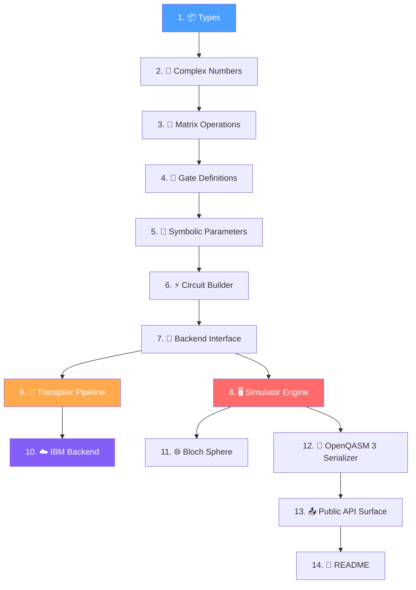

# ⚛️ Quantum Circuit Simulation Library — AGENTS.md Specification

> 🤖 **A complete, language-agnostic specification for building a quantum
> circuit simulation library from scratch — designed to be executed by AI coding
> agents.**

---

## 📖 What Is This?

This repository contains an [`AGENTS.md`](AGENTS.md) file — a detailed,
structured prompt that instructs an AI coding agent to build a **fully
self-contained quantum circuit simulation library** in any programming language.

The specification covers:

| Area                          | Details                                                                                         |
| ----------------------------- | ----------------------------------------------------------------------------------------------- |
| 🧮 **Core Math**              | Complex numbers, matrix algebra, tensor products — all from scratch, no external math libraries |
| 🔧 **52+ Quantum Gates**      | Every standard gate (Pauli, Hadamard, CNOT, Toffoli, etc.) with explicit matrix definitions     |
| 🔁 **Circuit Builder**        | Declarative, chainable API with symbolic parameters and classical control flow                  |
| ⚡ **State-Vector Simulator** | Born-rule measurement, subspace iteration, mid-circuit measurement support                      |
| 🔀 **Transpilation Pipeline** | SABRE layout/routing, ZYZ & KAK decomposition, basis gate translation, optimization passes      |
| ☁️ **IBM Backend**            | Full transpilation + OpenQASM 3 serialization + cloud API integration                           |
| 🌐 **Bloch Sphere**           | Qubit state introspection via reduced density matrices                                          |
| 📝 **OpenQASM 3**             | Complete serialize/deserialize implementation                                                   |
| ✅ **530+ Tests**             | Exhaustive test plan with statistical verification                                              |

> [!NOTE]
> The AI will **ask you which programming language** to use before writing any
> code. The architecture is fully language-agnostic.

---

## 🚀 How to Run This Specification

The `AGENTS.md` file is compatible with any AI coding agent that reads
project-level instruction files. Below are setup instructions for every major
tool.

---

### Claude Code (CLI)

Claude Code **natively reads `AGENTS.md`** files from your project root — no
extra configuration needed.

```bash
# Install Claude Code
npm install -g @anthropic-ai/claude-code

# Navigate to this repo and launch
cd /path/to/this-repo
claude
```

Once inside the session, simply tell it to start:

```
> Build the quantum simulation library in TypeScript
```

Claude Code will automatically pick up the `AGENTS.md` and follow the full
specification.

> [!TIP]
> For long builds, use `/compact` periodically to free up context window space.

---

### Cursor

Cursor reads instruction files from the `.cursor/rules/` directory or
project-root markdown files.

1. Open this repository in Cursor
2. The `AGENTS.md` will be available as project context
3. Alternatively, create a rule:

```bash
mkdir -p .cursor/rules
cp AGENTS.md .cursor/rules/quantum-spec.md
```

4. Open the AI chat panel (<kbd>Ctrl</kbd>+<kbd>L</kbd>) and prompt:

```
Follow the AGENTS.md specification to build the quantum simulation library in Python
```

---

### GitHub Copilot (Agent Mode)

GitHub Copilot in VS Code reads project instructions from
`.github/copilot-instructions.md`.

1. Copy the spec into Copilot's instruction file:

```bash
mkdir -p .github
cp AGENTS.md .github/copilot-instructions.md
```

2. Open VS Code with the GitHub Copilot extension
3. Switch to **Agent Mode** in the Copilot Chat panel
4. Prompt:

```
Build the quantum simulation library following the project instructions. Use Rust.
```

---

### Amazon Q Developer (CLI & IDE)

Amazon Q Developer reads project instructions from `.amazonq/rules/` directory.

1. Set up the rules directory:

```bash
mkdir -p .amazonq/rules
cp AGENTS.md .amazonq/rules/quantum-spec.md
```

2. **CLI usage:**

```bash
q chat
```

3. **IDE usage:** Open in VS Code/JetBrains with the Amazon Q extension
   installed

4. Prompt:

```
Follow the quantum-spec rules to build the library in Go
```

---

### Windsurf (Codeium)

Windsurf reads global and project-level rules from `.windsurfrules` or the
Cascade panel.

1. Copy the spec:

```bash
cp AGENTS.md .windsurfrules
```

2. Open the repository in Windsurf
3. Use the **Cascade** panel and prompt:

```
Build the quantum simulation library in TypeScript following the project rules
```

---

### Cline (VS Code Extension)

Cline reads project instructions from `.clinerules/` or a `.clinerules` file.

1. Set up:

```bash
mkdir -p .clinerules
cp AGENTS.md .clinerules/quantum-spec.md
```

2. Open VS Code with the Cline extension
3. In the Cline panel, prompt:

```
Follow the quantum-spec instructions to build the library in Python
```

> [!TIP]
> Cline works with multiple LLM providers (Anthropic, OpenAI, Google, etc.).
> Choose your preferred model in Cline's settings.

---

### ChatGPT / OpenAI (Manual)

ChatGPT and OpenAI models don't natively read `AGENTS.md` files, but you can
provide it as context.

**Via ChatGPT (Web/App):**

1. Start a new conversation
2. Attach the `AGENTS.md` file using the 📎 attachment button
3. Prompt:

```
This is a complete specification for a quantum simulation library.
Follow it step by step to build the library in Python.
Start with Step 1 (Types) and proceed in order.
```

**Via OpenAI Codex CLI:**

```bash
# Install Codex CLI
npm install -g @openai/codex

# Run with the spec as context
cd /path/to/this-repo
codex
```

Then prompt it to read `AGENTS.md` and follow the specification.

---

### Google Gemini CLI

```bash
# Install Gemini CLI
npm install -g @anthropic-ai/claude-code  # placeholder — use actual Gemini CLI install
# Check https://github.com/google-gemini/gemini-cli for install instructions

cd /path/to/this-repo
gemini
```

Gemini CLI reads `GEMINI.md` files by default:

```bash
cp AGENTS.md GEMINI.md
```

Then prompt:

```
> Build the quantum simulation library in TypeScript
```

---

### 🔧 Aider

[Aider](https://aider.chat) is an open-source AI pair programming tool that
works with multiple LLM providers.

```bash
# Install aider
pip install aider-chat

# Run with the spec file added to context
cd /path/to/this-repo
aider --read AGENTS.md
```

Then prompt:

```
Follow the AGENTS.md specification to build the quantum simulation library in Python. Start with Step 1.
```

> [!TIP]
> Use `--model` to select your preferred LLM provider (e.g.,
> `--model claude-oppus`, `--model gpt-5.4`, `--model gemini/gemini-pro`).

---

### 💬 Generic / Other LLMs

For any LLM or tool not listed above, you can always provide the specification
manually:

1. **Copy the full contents** of [`AGENTS.md`](AGENTS.md)
2. **Paste it** at the beginning of your conversation
3. **Follow up** with:

```
This is the complete specification. Build the library in [YOUR LANGUAGE].
Start with Step 1 (Types) and proceed in order.
After each module, write and run the tests before moving on.
```

> [!IMPORTANT]
> Due to the specification's length (~3,000 lines), some models may need it
> split across multiple messages or provided as a file attachment.

---

## 🗺️ Build Order Overview

The specification enforces a strict dependency-aware build order:



Each step **must have passing tests** before proceeding to the next.

---

## 📊 Test Coverage Summary

| Module      | Min. Tests |         Category         |
| :---------- | :--------: | :----------------------: |
| Types       |     10     |           Unit           |
| Complex     |     40     |           Unit           |
| Matrix      |     45     |           Unit           |
| Gates       |     80     |           Unit           |
| Parameters  |     15     |           Unit           |
| Circuit     |     40     |           Unit           |
| Backend     |     5      |           Unit           |
| Simulator   |     60     |           Unit           |
| Transpiler  |     40     |           Unit           |
| IBM Backend |     20     | Unit (partially skipped) |
| Bloch       |     20     |           Unit           |
| Serializer  |     25     |           Unit           |
| Integration |    130     |        End-to-end        |
| **Total**   |  **530+**  |            ✅            |

---

## 📜 License

MIT - Henrique Emanoel Viana

---

<div align="center">

**Built with 🤖 AI agents, specified by humans.**

_Star ⭐ this repo if you find the specification useful!_

</div>
